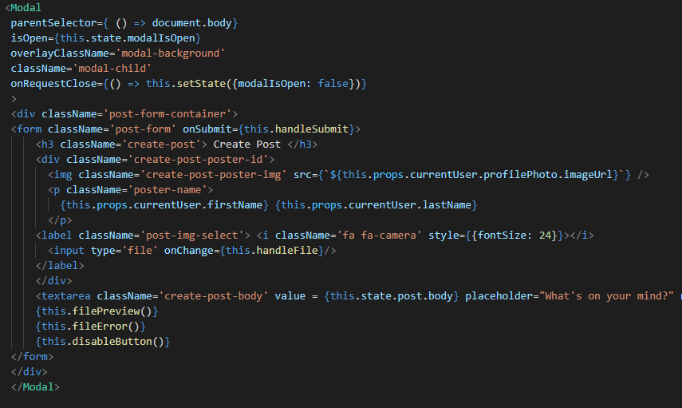
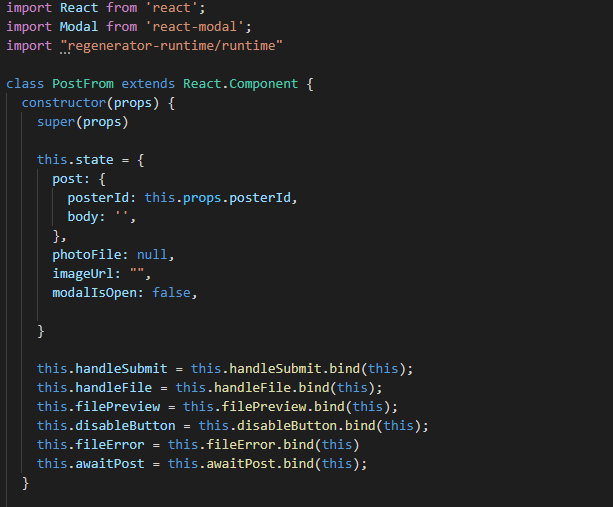
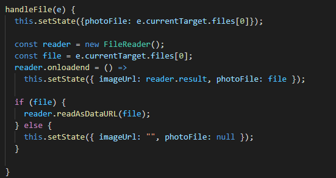
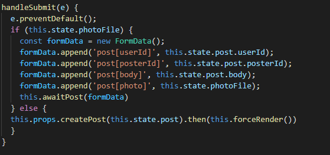
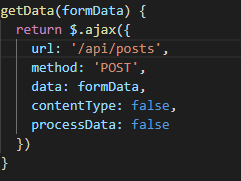
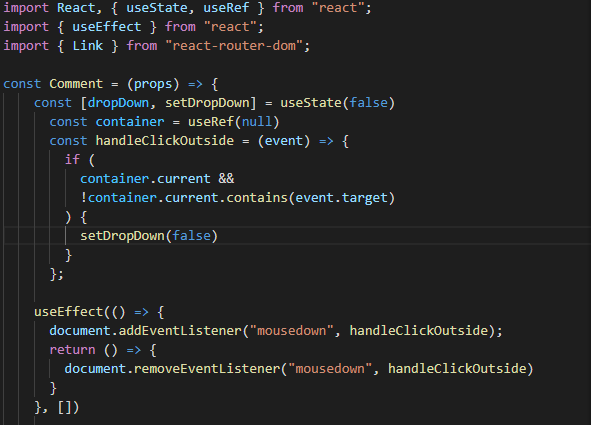
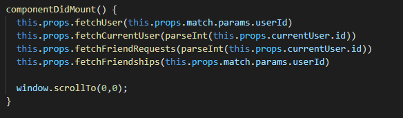
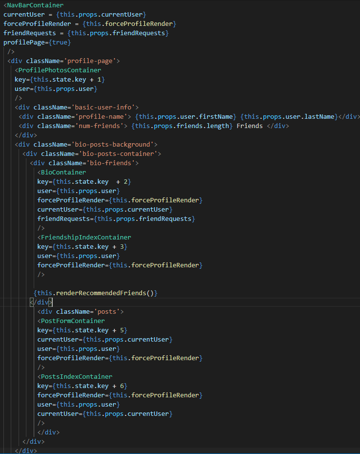

# Ourspace 

This is a fullstack application designed to be a clone of facebook where users may create profiles, posts, and become "friends" with each other, by which a user may comment on and like their friends' posts.

Technologies Used:

* Ruby on Rails for controlling the RESTful routes and the overall backend

* React for the frontend supported by Redux for managing state

* PostgreSQL for the database

* AWS for storing photos

* Heroku for deploying a build / [Ourspace deployed on Heroku](https://our-space-facebook-clone.herokuapp.com/#/)

## Features and Development 
---

As briefly mentioned before, Ourspace was developed to be a clone of facebook, in which it carries much of the same basic functionality. Here I will be going into some of those features and how I implemented them in development. 

### Modals

Much of the user input is done through a modal, whether it is creating an account, updating a profile, or creating a post. In this application I installed and imported react-modal. The following code snippet is an example of the React Modal, in this case for the Post form. 

When toggling the Modal on and off, we can use React Modal's onRequestClose, which accounts for the user clicking outside the modal. I simply create a modalIsOpen state, which I toggle from true to false or vice-versa dependant on the users interaction. Also notice overlayClassName and className, which account for the styling in the background and the modal itself respectfully. Using the React Modal allowed for a more efficient implementation of modals overall. 

### Posts

Posts were the first major feature that I implemented. Using a React Class Component, posts utilized the above React Modal for the Post Form (creating a post) and the actual posts themselves contain the comments component, which is a functional component that utilizes hooks. Center to the experience of Ourspace, the post-form and posts components are the largest files with the most functions of any of the other components. Here is a snippet of the constructor of the post-form.

A skeleton of a post is created when the constructor runs, creating a post body (the text of a post), but as any user would expect, users are also able to attach photos to their posts. To do this, I initialize a photoFile to null in state, and if the user selects and creates a post with a photo, we utilize the HTML input type 'file', formData for the API request, and AWS for the eventual storage of the photo. Here are a few snippets displaying that process.

This function is call onChange in the input type 'file.'

 

Creating FormData for API request

Utilizing Ajax for the request. (All requests in this application utilize Ajax)

### Comments

While posts utilize a React Class Component, I opted to use a Functional Component for comments, as comments as a component in general are not as complicated as my post components. However, as you'll see below, I did end up using many of the common React hooks.

The hooks used here don't have much to do with the comment itself, rather a dropdown next to the comments for users to delete their own comments. I utilize useEffect, which is comparable to ComponentDidMount and ComponentWillUnmout (the return). I also used useState to create a state for this dropdown which can be toggled between true and false, much like the modals.

### Profiles

Users are able to personalize their profile by selecting background and profile pictures as well as customizing some basic info about themselves. Changing the photos is much like posting photos, but with a different route, so I won't be providing snippets in this README of that. However, I will focus on the overall structure of the application, as profiles contain contain most of the other components. 

Upon loading a profile page, I will utilize Redux and a centralized state for which we will load the other components. 

We fetch the info with componentDidUpdate as well. From here we feed the basic info of the currentUser and the user whose profile we are visiting to all these components which build up the profile page we see. The user profile page is analogous to a root node of a tree. 

